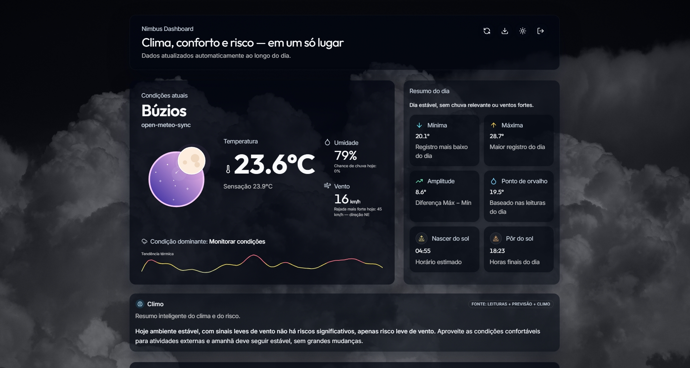
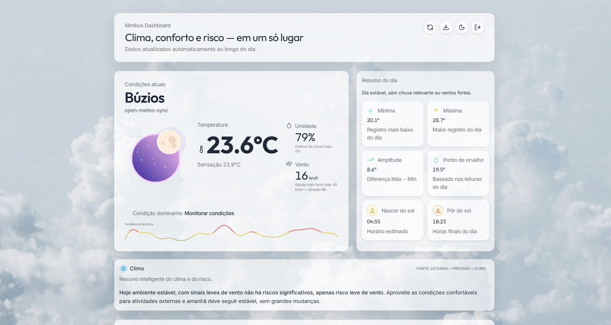

# GDASH Weather Insights – Desafio 2025/02

Aplicação full-stack que monitora clima real de Búzios/RJ, processa dados via fila e entrega um dashboard rico em insights. Toda a solução roda em containers: Python coleta dados da Open-Meteo, o worker Go entrega registros à API NestJS + MongoDB, e o frontend React mostra dashboards, IA “Climo”, exports CSV/XLSX e CRUD de usuários. O objetivo é demonstrar integração entre múltiplas linguagens/serviços com foco em experiência do avaliador.

## Visão de arquitetura & pipeline

1. **Collector Python** consulta a Open-Meteo, normaliza métricas e publica JSON na fila RabbitMQ.
2. **RabbitMQ** mantém os eventos `weather-logs` até o consumo seguro pelo worker.
3. **Worker Go** valida payloads, obtém JWT e chama `POST /api/weather/logs` na API NestJS.
4. **API NestJS** persiste registros no MongoDB, emite eventos WebSocket, gera insights e oferece CRUD de usuários + exportações CSV/XLSX.
5. **MongoDB** armazena históricos de clima e usuários.
6. **Frontend React + Vite + Tailwind + shadcn/ui** consome os endpoints, mostra painéis em tempo real e interage com o módulo de IA “Climo”.

## Demonstração em vídeo

Assista ao walkthrough completo (YouTube não listado): https://youtu.be/XAHrCk4JbwY

## Screenshots do Dashboard

Visão geral da área superior/hero do dashboard:




## IA & insights (Climo)

O **Climo** combina estatísticas recentes, previsões e heurísticas locais para produzir resumos inteligentes sobre conforto térmico, chuva e vento. O frontend apresenta cartões confiáveis que indicam riscos, recomendações e explica se a análise veio de dados reais ou apenas da previsão, permitindo decisões rápidas.

## Como rodar (recomendado para avaliadores)

```bash
docker compose -f infra/docker-compose.yml up --build
docker compose -f infra/docker-compose.yml up
docker compose -f infra/docker-compose.yml down
```

> O collector aguarda automaticamente o RabbitMQ antes de iniciar; é normal levar alguns segundos até que o pipeline Python → RabbitMQ → Go esteja pronto.

## Atalho de desenvolvimento (opcional)

```bash
./scripts/run-dev.sh
./scripts/stop-dev.sh
```

Esses scripts são apenas uma conveniência local (sobem o Compose e iniciam `npm run dev`). O fluxo oficial para avaliação continua sendo o Docker Compose descrito acima.

## Acesso rápido

- **Frontend:** http://localhost:4173
- **API (NestJS):** http://localhost:3000/api
- **Admin padrão:** `admin@example.com` / `123456` (configurável em `.env`)

### Exportação de dados

O dashboard expõe botões que chamam `GET /api/weather/export.csv` e `GET /api/weather/export.xlsx`, permitindo baixar todo o histórico registrado no MongoDB.
